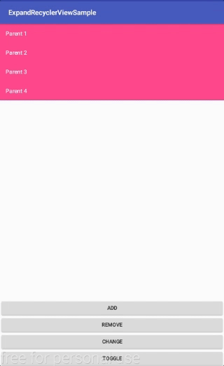

# ExpandableRecyclerview
ExpandableRecyclerview is a library that allows you to create a expandle recyclerview  
- SlidingTab
- Tab Normal

  
  
  
  
  
  
  
  
  
  
---


# Table of Contents

1. [Gradle Dependency](https://github.com/ATHBK/SlidingTabLayout#gradle-dependency)
   1. [Repository](https://github.com/ATHBK/SlidingTabLayout#repository)
   2. [Dependency](https://github.com/ATHBK/SlidingTabLayout#dependency)
2. [Basic Usage](https://github.com/ATHBK/SlidingTabLayout#basic-usage)
   1. [IndicatorView XML](https://github.com/ATHBK/SlidingTabLayout#slidingtablayout-xml)
   2. [Attributes](https://github.com/ATHBK/SlidingTabLayout#slidingtablayout-attr )
3. [Init Java](https://github.com/ATHBK/SlidingTabLayout#init-from-java)
4. [License](https://github.com/ATHBK/SlidingTabLayout#license)

   
---

# Gradle Dependency


#### Repository

Add this in your root `build.gradle` file (**not** your module `build.gradle` file):

```gradle
allprojects {
	repositories {
		...
		maven { url 'https://jitpack.io' }
	}
}
```

#### Dependency

Add this to your module's `build.gradle` file:

```gradle
dependencies {
	compile 'com.github.ATHBK:SlidingTabLayout:v1.0'
}
```

---

# Basic Usage

#### SlidingTabLayout XML

To use this SlidingTabLayout in your layout simply copy and paste the xml below. This provides the default indicator. 

1. With TabLayout:
```xml
<com.athbk.slidingtablayout.TabLayout
        android:layout_width="match_parent"
        android:layout_height="wrap_content"
        android:id="@+id/tabLayout"
        android:background="@color/colorGray"
        app:tab_text_color="@color/tab_color_seleted"
/>
````
2. With SlidingTabLayout:
```xml
<com.athbk.slidingtablayout.SlidingTabLayout
        android:layout_width="match_parent"
        android:layout_height="wrap_content"
        android:id="@+id/tabLayout"
        android:background="@color/colorGray"
	/>
```
#### SlidingTabLayout Attr 

There are several other attributes that can be used to configure color text, icon, background tab, size.
1.  With TabLayout:

| Attrrs                 |                        |  type   |
| -----------------------|:----------------------:|---------|
| tab_text_size          | size of text           |dimension|
| tab_text_color         | color of text          |reference|
| tab_under_line_color   | color of under line    |color    |
| tab_under_line_visible | visible of under line  |boolean  |
| tab_auto_align         | auto align width size  |boolean  |
| tab_padding_left       | padding left           |dimension|
| tab_padding_right      | padding right          |dimension|
| tab_padding_top        | padding top            |dimension|
| tab_padding_bottom     | padidng bottom         |dimension|
| tab_background         | customer background tab|reference|


2. With SlidingTabLayout:

| Attrrs                    |                        |  type   |
| --------------------------|:----------------------:|---------|
| sl_tab_text_size          | size of text           |dimension|
| sl_tab_text_color         | color of text          |reference|
| sl_tab_under_line_color   | color of under line    |color    |
| sl_tab_under_line_visible | visible of under line  |boolean  |
| sl_tab_size_width         | size width of tab      |dimension|
| sl_tab_padding_left       | padding left           |dimension|
| sl_tab_padding_right      | padding right          |dimension|
| sl_tab_padding_top        | padding top            |dimension|
| sl_tab_padding_bottom     | padidng bottom         |dimension|
| sl_tab_background         | customer background tab|reference|

---

# Init from Java

#### Java

How to use in . 

```java	
	ViewPagerAdapter adapter = new ViewPagerAdapter(getSupportFragmentManager(), listFragment, listTab);
        viewPager.setAdapter(adapter);
        tabLayout.setViewPager(viewPager, adapter);
```

** Note: Adapter must extends SlidingTabAdapter

- If title is empty, tab will show only icon
- If icon is empty, tab will show only title
- If title and icon is'nt empty, tab will show both.

---
# License

    Copyright 2017 ATHBK

    Licensed under the Apache License, Version 2.0 (the "License");
    you may not use this file except in compliance with the License.
    You may obtain a copy of the License at

       http://www.apache.org/licenses/LICENSE-2.0

    Unless required by applicable law or agreed to in writing, software
    distributed under the License is distributed on an "AS IS" BASIS,
    WITHOUT WARRANTIES OR CONDITIONS OF ANY KIND, either express or implied.
    See the License for the specific language governing permissions and
    limitations under the License.
