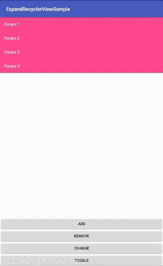
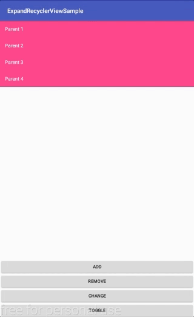

# ExpandableRecyclerview
ExpandableRecyclerview is a library that allows you to create a expandle recyclerview  

1. Add or Remove a Parent	
  
  
2. Add or Remove more a parent  
  
  
3. Add or Remove a Children  
  
  
4. Add or Remove more a Children  
  
---


# Table of Contents

1. [Gradle Dependency](https://github.com/ATHBK/ExpandableRecyclerview#gradle-dependency)
   1. [Repository](https://github.com/ATHBK/ExpandableRecyclerview#repository)
   2. [Dependency](https://github.com/ATHBK/ExpandableRecyclerview#dependency)
2. [Init Java](https://github.com/ATHBK/ExpandableRecyclerview#init-from-java)
   1. [Java](https://github.com/ATHBK/ExpandableRecyclerview#Java)
   2. [ExpandableRecyclerview Support Function](https://github.com/ATHBK/ExpandableRecyclerview#ExpandableRecyclerview-Support-Function)
3. [License](https://github.com/ATHBK/ExpandableRecyclerview#license)

   
---

# Gradle Dependency


#### Repository

Add this in your root `build.gradle` file (**not** your module `build.gradle` file):

```gradle
allprojects {
	repositories {
		...
		maven { url 'https://jitpack.io' }
	}
}
```

#### Dependency

Add this to your module's `build.gradle` file:

```gradle
dependencies {
	compile 'com.github.ATHBK:SlidingTabLayout:v1.0'
}
```

---

# Init from Java

#### Java

How to use.
1. Declare class ParentModel implements Parent<ChildModel>
2. Declare class ChildModel.
3. Declare class Adapter extends ExpandableRecyclerViewAdapter
4. Init
```java	
	adapter = new Adapter(listParent);
        recyclerView.setAdapter(adapter);
```

#### ExpandableRecyclerview Support Function:


|                                    Funtion               		       |
| -----------------------------------------------------------------------------|
| updateExpandAll()      		   				       |
| updateCollapseAll()    		   				       |
| notifyParentInsert(int parentPosition)   				       |
| notifyParentRangeInsert(int startPosition, int count) 		       |
| notifyParentRemove(int parentPosition)         			       |
| notifyParentRangeRemove(int startPosition, int count)       		       |
| notifyParentChange(int parentPosition)      				       |
| notifyParentRangeChange(int startPosition, int count)       		       |
| notifyChildInsert(int parentPosition, int childPosition)     		       |
| notifyChildRangeInsert(int parentPosition, int startChildPosition, int count)|
| notifyChildRemove(int parentPosition, int childPosition)		       |
| notifyChildRangeRemove(int parentPosition, int startChildPosition, int count)|
| notifyChildChange(int parentPosition, int childPosition)   		       |
| notifyChildRangeChange(int parentPosition, int startChildPosition, int count)|
---

# License

    Copyright 2017 ATHBK

    Licensed under the Apache License, Version 2.0 (the "License");
    you may not use this file except in compliance with the License.
    You may obtain a copy of the License at

       http://www.apache.org/licenses/LICENSE-2.0

    Unless required by applicable law or agreed to in writing, software
    distributed under the License is distributed on an "AS IS" BASIS,
    WITHOUT WARRANTIES OR CONDITIONS OF ANY KIND, either express or implied.
    See the License for the specific language governing permissions and
    limitations under the License.
